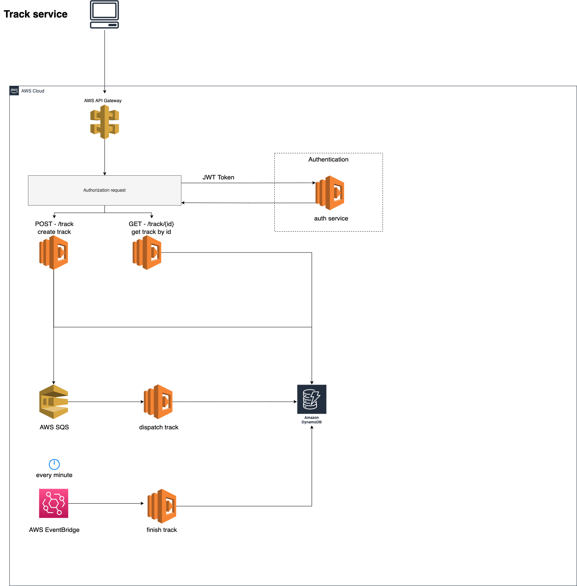

# Architeture #



Deploy stack to AWS
```
$ sls deploy --verbose
```

Redeploy just a function
```
$ sls deploy -f functioname --verbose
```

Invoke function
```
sls invoke -f functioname -l
```

For see function's logs
```
$ sls logs -f functioname -t 
```

Delete stack to AWS
```
sls remove --verbose
```
